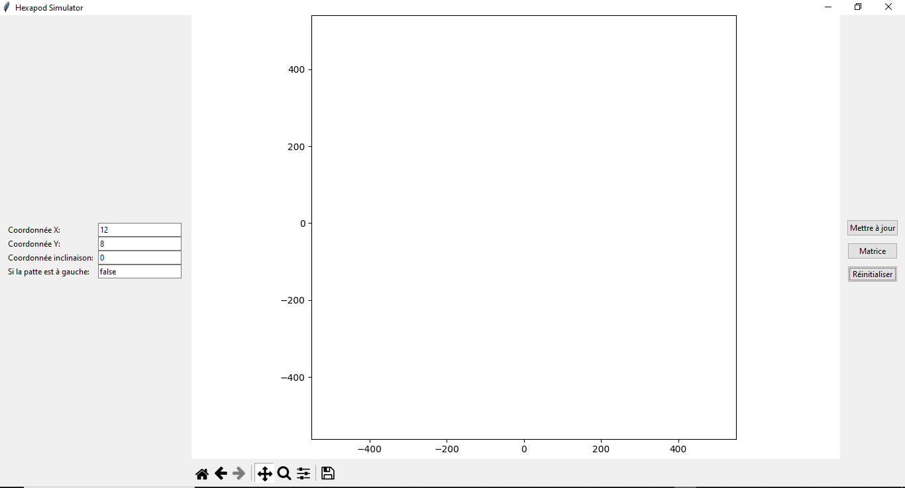
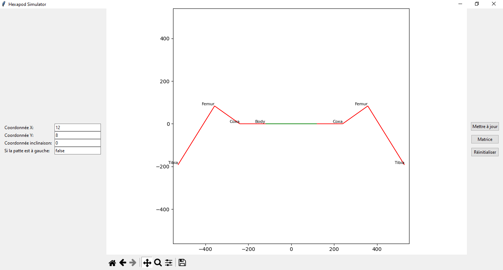
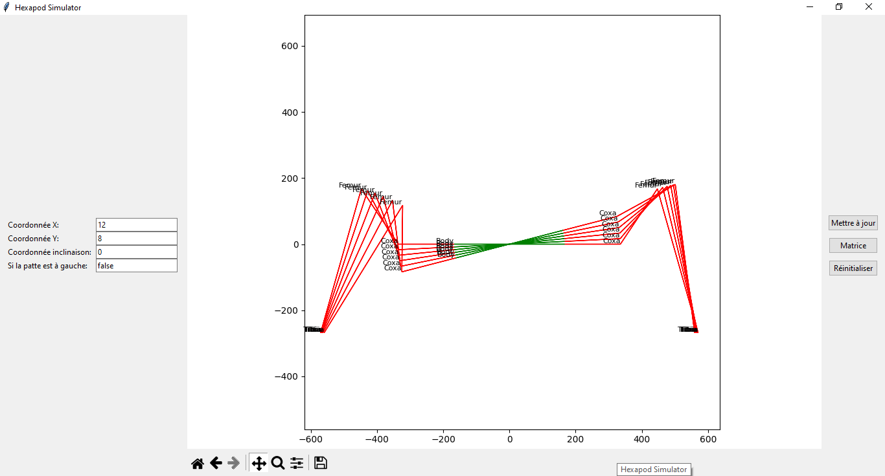

# Simulateur 2D pour Aash

### Description
*Cet application est le début d'un simulateur pour robot hexapod dont `Aash` pour le moment, il a été codé en python et utilise l'algorithme golang ( `algorithme.go` ) pour le moment*

*Il permet de visualiser les mouvements exercés par les servomoteurs sur la patte du robot grace à la cinématique inversée*

*Cela vous permet de créer vos animations juste en donnant une position `x` et `y`*

### Visuel

### Installation

**Pour utiliser ce programme il vous faudra installer Python et Golang.**

- Programme d'installation standard:
  * [Cliquez ici pour installer Python](https://www.python.org/downloads/)
  * [Cliquez ici pour installer Go](https://go.dev/doc/install)

- Scoop:

  * `scoop install python && scoop install go`

---

### Télécharger le code source

*Utiliser git vous permettra de mettre à jours l'entierté de hexa quand vous voulez avec la commande `git pull` dans votre dossier `hexa`*

[*Lien pour télécharger `Git`*](https://git-scm.com/downloads)

commande d'installation avec Git: `git clone https://notpunchnox/hexa`

---
### Installation des dépendances

Une fois installé allez dans le dossier du simulateur
cmd: `cd hexa/simulator/2D`

Puis effectuez l'installation des dépendances avec la commande suivante: `pip install -r requirements.txt`

---
### Lancement du programme
Pour lancer le programme il suffit d'executer le fichier `launch.bat` ou la commande suivante: `py ./src/simulator.py`